# Life Bookshelf AI

인생책장 서비스의 AI 서버 레포지토리

## 프로젝트 구조

- **flows**

  - autobiograpies
    - chat
    - evaluation
    - standard
      - **generate_autobiography**
      - **generate_correction**
  - chapters
    - chat
    - evaluation
    - standard
      - **generate_chapter**
  - interviews
    - chat
      - **interview_chat**
    - evaluation
    - standard
      - **generate_interview_question**

- **serve**
  - autobiographies
    - **generate_autobiography**
    - **generate_correction**
  - chapters
    - **generate_chapter**
  - interviews
    - **generate_interview_question**
    - **interview_chat**

autobiobraphies, chapters, interviews 총 3개의 도메인이 존재합니다.

- **flows** 에는 각 도메인 별로 chat, evaluation, standard 3가지 종류의 flow가 존재합니다.
- **serve** 에는 각 도메인 별로 flows 경로에 구성했던 flow를 서빙하는 서버 코드가 존재합니다.

## 로컬 개발 환경 설정 (flows)

### Python 설치

[Python](https://www.python.org/downloads/) (3.9 이상)을 설치합니다.

### Prompt Flow Extension 설치

[Prompt Flow Extension](https://marketplace.visualstudio.com/items?itemName=prompt-flow.prompt-flow)을 설치합니다.

### OpenAI API Key 발급

[OpenAI API Key 발급](https://platform.openai.com/)에서 API Key를 발급받습니다.

[Azure OpenAI API Key 발급](https://ai.azure.com/)에서 API Key를 발급받습니다.

> AZure OpenAI를 활용하는 경우, https://learn.microsoft.com/ko-kr/legal/cognitive-services/openai/limited-access 에서 Azure OpenAI 서비스에 대한 엑세스를 신청해야 할 수 있습니다.

### Basic Setup

```bash
git clone git@github.com:life-librarians/life-bookshelf-ai.git
```

```bash
cd life-bookshelf-ai
```

```bash
code flows/[개발할 플로우 디렉토리]
```

개발할 플로우의 디렉토리를 열기

```bash
python3 -m venv .venv
```

required python3 ≥ `Python 3.9.x` (3.9.x 권장)

```bash
source .venv/bin/activate
```

```bash
pip install -r requirements.txt
```

```bash
pip install --upgrade pip
```

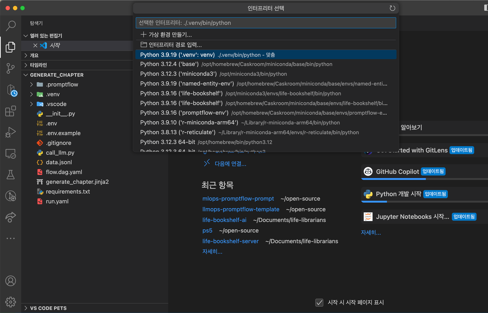

VSCode에서 인터프리터도 변경해주어야 합니다.

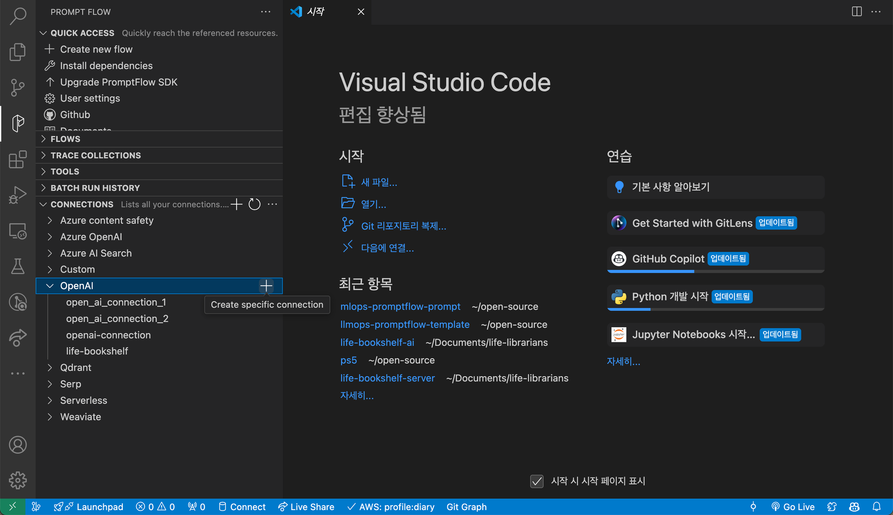

Prompt Flow Extension에서 Connection을 설정해줍니다.


connection 이름을 설정하고 Create Connection 클릭합니다. (다른건 수정 X)

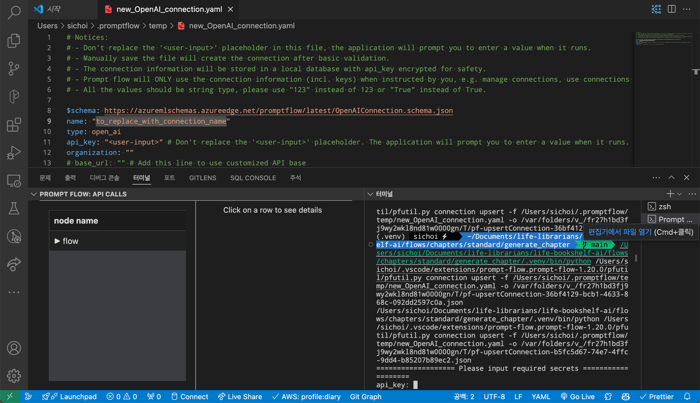
터미널에서 api_key를 입력하면 connection 등록이 완료됩니다.

> name의 값을 **open_ai_connection** 으로 설정해야 합니다.

### Flow Test Run 실행

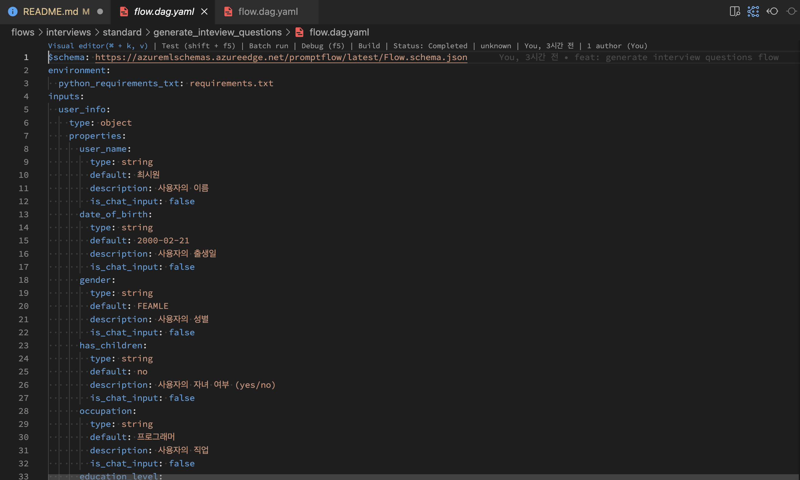

**[실행을 원하는 플로우 경로]/flow.dag.yaml** 파일을 열어 Visual Editor를 실행해줍니다.

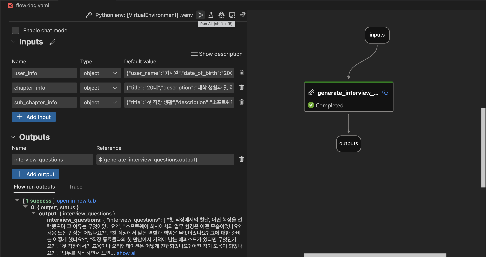

Test Run을 실행해줍니다.

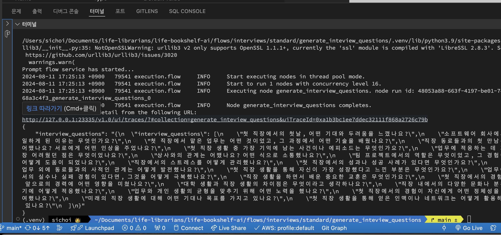

터미널에서 결과를 확인할 수 있습니다.

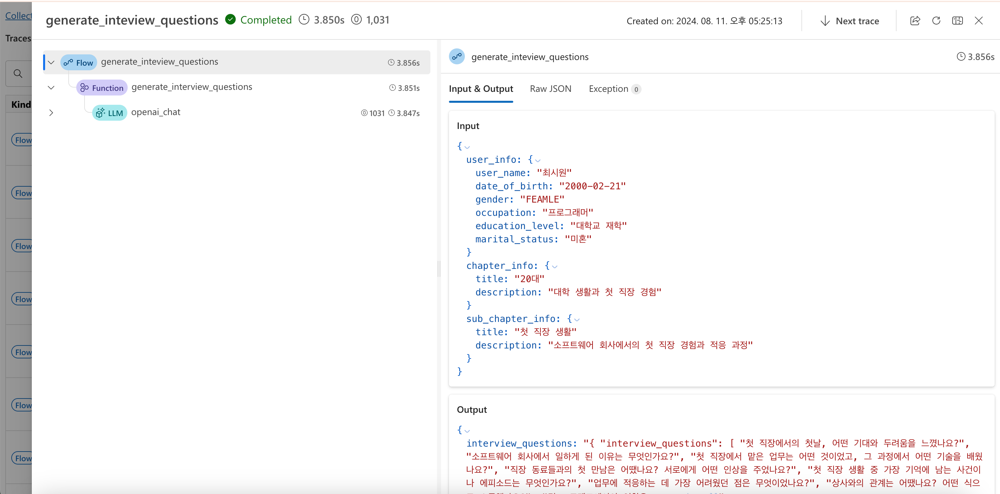
또한 제공되는 링크를 열어 웹에서도 결과를 확인할 수 있습니다.

### Flow Batch Run 실행

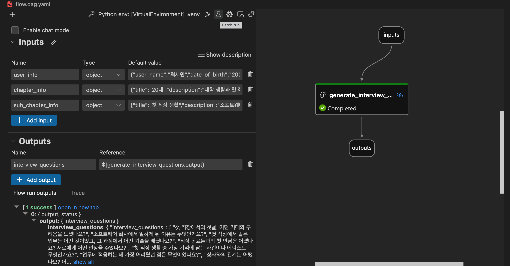

Batch Run을 실행해줍니다.
Batch Run은 미리 준비한 데이터를 이용하여 여러번의 Test Run을 실행하는 것입니다.

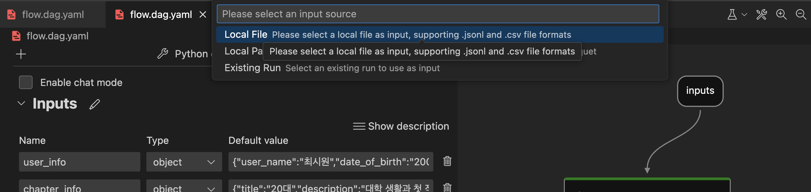

Local File을 선택합니다.

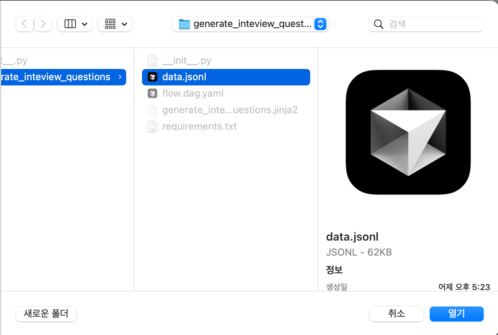

**data.json** 파일을 선택합니다.

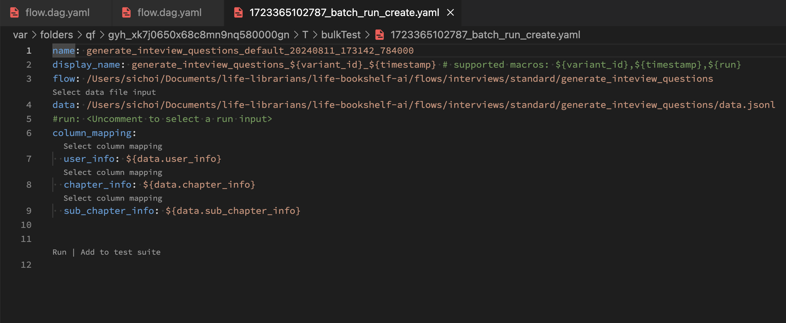

Batch Run을 실행합니다.

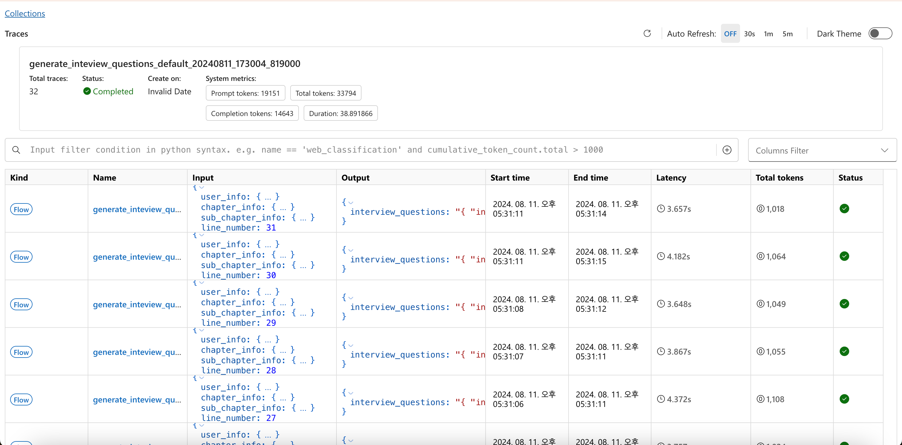

웹에서 결과를 확인할 수 있습니다.

## 로컬 개발 환경 설정 (serve)

### Python 설치

[Python](https://www.python.org/downloads/) (3.9 이상)을 설치합니다.

```bash
git clone git@github.com:life-librarians/life-bookshelf-ai.git
```

```bash
cd life-bookshelf-ai
```

```bash
code serve
```

개발할 serve 디렉토리를 열기

```bash
python3 -m venv .venv
```

required python3 ≥ `Python 3.9.x` (3.9.x 권장)

```bash
source .venv/bin/activate
```

```bash
pip install -r requirements.txt
```

```bash
cp .env.example .env.development
```

`.env.development` 파일을 생성합니다.

```.env.example
DEBUG=True
LOG_LEVEL=DEBUG

# Azure OpenAI의 API Key를 사용하는 경우
# AZURE_OPENAI_API_KEY=your-api-key
# AZURE_OPENAI_API_BASE=https://your-api-base.openai.azure.com
# AZURE_OPENAI_API_TYPE=azure

# OpenAI의 API Key를 사용하는 경우
AZURE_OPENAI_API_KEY=sk-your-api-key
LIFE_BOOKSHELF_AI_JWT_SECRET_KEY=0190ab45-7e42-7a3f-9dec-726ddf778076
```

자신의 API Key를 입력합니다.

```bash
python -m uvicorn main:app --env-file .env.development --port 3000
```

3000 포트에서 fastapi 서버를 실행합니다.

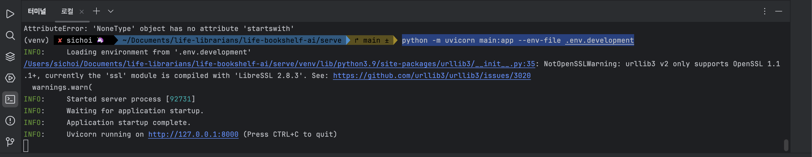

서버가 정상적으로 실행되었을 경우 위와 같은 로그가 출력됩니다. (실제 로그는 3000포트로 출력됩니다.)

http://localhost:3000/docs 에서 API 문서를 확인할 수 있습니다. (사용 방법 참고: [Life Bookshelf Server](https://github.com/life-librarians/life-bookshelf-server?tab=readme-ov-file#swagger-%EC%9D%B4%EC%9A%A9-%EB%B0%A9%EB%B2%95))
